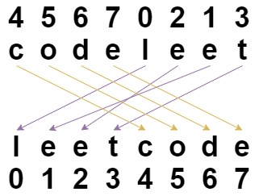

[](https://leetcode.com/problems/shuffle-string/)

<br />
<!-- <br /> -->
<!-- <br /> -->

You are given a string s and an integer array indices of the same length. The string s will be shuffled such that the character at the ith position moves to `indices[i]` in the shuffled string.

Return the shuffled string.

**Example 1:**



```
Input: s = "codeleet", indices = [4,5,6,7,0,2,1,3]
Output: "leetcode"
Explanation: As shown, "codeleet" becomes "leetcode" after shuffling.
```

**Example 2:**

```
Input: s = "abc", indices = [0,1,2]
Output: "abc"
Explanation: After shuffling, each character remains in its position.
```
**Constraints:**

```
s.length == indices.length == n
1 <= n <= 100
s consists of only lowercase English letters.
0 <= indices[i] < n
All values of indices are unique.
```

**Solutions**

```ts
// Time complexity: O(n)
// Space complexity: O(n)

function restoreString(s: string, indices: number[]): string {
  return indices.reduce((prev, indice, i) => {
    prev[indice] = s[i];
    return prev;
  }, []).join('');
};
```