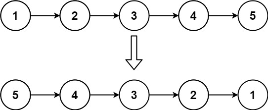
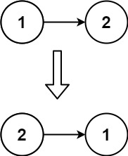

[](https://leetcode.com/problems/reverse-linked-list/)

<br />
<!-- <br /> -->
<!-- <br /> -->

Given the `head` of a singly linked list, reverse the list, and return the reversed list.

**Example 1:**



```
Input: head = [1,2,3,4,5]
Output: [5,4,3,2,1]
```

**Example 2:**



```
Input: head = [1,2]
Output: [2,1]
```

**Example 3:**

```
Input: head = []
Output: []
```

**Constraints:**

```
The number of nodes in the list is the range [0, 5000].
-5000 <= Node.val <= 5000
```

**Follow up:**

A linked list can be reversed either iteratively or recursively. Could you implement both?

**Solutions**

```ts
// Method 1: Iterative
// Time complexity: O(n)
// Space complexity: O(1)

/**
 * Definition for singly-linked list.
 * class ListNode {
 *     val: number
 *     next: ListNode | null
 *     constructor(val?: number, next?: ListNode | null) {
 *         this.val = (val===undefined ? 0 : val)
 *         this.next = (next===undefined ? null : next)
 *     }
 * }
 */

// Iterative
function reverseList(head: ListNode | null): ListNode | null {
  let prev = null;
  while (head) {
    const next = head.next;

    head.next = prev;

    prev = head;
    head = next; 
  }

  return prev;
};
```

```ts
// Method 2: Recursive
// Time complexity: O(n)
// Space complexity: O(n)

/**
 * Definition for singly-linked list.
 * class ListNode {
 *     val: number
 *     next: ListNode | null
 *     constructor(val?: number, next?: ListNode | null) {
 *         this.val = (val===undefined ? 0 : val)
 *         this.next = (next===undefined ? null : next)
 *     }
 * }
 */

// Recursive
function reverseList(head: ListNode | null): ListNode | null {
  if (head === null || head.next === null) return head;

  const reversedList = reverseList(head.next);

  const next = head.next;
  next.next = head;
  head.next = null;

  return reversedList;
};
```