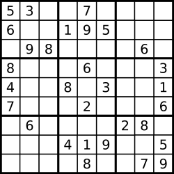

[](https://leetcode.com/problems/valid-sudoku/)

<!-- <br /> -->
<br />
<!-- <br /> -->

Determine if a 9 x 9 Sudoku board is valid. Only the filled cells need to be validated according to the following rules:

Each row must contain the digits `1-9` without repetition.

Each column must contain the digits `1-9` without repetition.

Each of the nine `3 x 3` sub-boxes of the grid must contain the digits `1-9` without repetition.

Note:
- A Sudoku board (partially filled) could be valid but is not necessarily solvable.
- Only the filled cells need to be validated according to the mentioned rules.


 *Example 1:**


```
Input: board = 
[["5","3",".",".","7",".",".",".","."]
,["6",".",".","1","9","5",".",".","."]
,[".","9","8",".",".",".",".","6","."]
,["8",".",".",".","6",".",".",".","3"]
,["4",".",".","8",".","3",".",".","1"]
,["7",".",".",".","2",".",".",".","6"]
,[".","6",".",".",".",".","2","8","."]
,[".",".",".","4","1","9",".",".","5"]
,[".",".",".",".","8",".",".","7","9"]]
Output: true
```

**Example 2:**
```
Input: board = 
[["8","3",".",".","7",".",".",".","."]
,["6",".",".","1","9","5",".",".","."]
,[".","9","8",".",".",".",".","6","."]
,["8",".",".",".","6",".",".",".","3"]
,["4",".",".","8",".","3",".",".","1"]
,["7",".",".",".","2",".",".",".","6"]
,[".","6",".",".",".",".","2","8","."]
,[".",".",".","4","1","9",".",".","5"]
,[".",".",".",".","8",".",".","7","9"]]

Output: false
Explanation: Same as Example 1, except with the 5 in the top left corner being modified to 8. Since there are two 8's in the top left 3x3 sub-box, it is invalid.
```

**Constraints:**
```
board.length == 9
board[i].length == 9
board[i][j] is a digit 1-9 or '.'.
```

**Solutions**

```ts
// Method 1: brute force
// Time complexity: O(n)
// Space complexity: O(1)

function isValidSudoku(board: string[][]): boolean {
  return validateAllRows(board) &&
        validateAllCols(board) &&
        validateAllSubBoards(board)
};

const isNumber = (num: string): boolean => {
  const numbers = ['1', '2', '3', '4', '5', '6', '7', '8', '9'];
  return numbers.some(str => str === num);
}

const validateMatrix = (x: number, y: number, p: number, q: number, board: string[][]): boolean => {
  const numSet = new Set;
  for (let i = x; i <= p; i++) {
    for (let j = y; j <= q; j++) {
      if (isNumber(board[i][j])) {
        if (numSet.has(board[i][j])) return false;
        else numSet.add(board[i][j]);
      }
    }
  }

  return true;
}

const validateAllRows = (board: string[][]): boolean => {
  for (let i = 0; i < board.length; i++) {
    if (!validateMatrix(0, i, board.length - 1, i, board)) return false;
  }  

  return true;
}

const validateAllCols = (board: string[][]): boolean => {
  for (let i = 0; i < board.length; i++) {
    if (!validateMatrix(i, 0, i, board.length - 1, board)) return false;
  }

  return true;
}

const validateAllSubBoards = (board: string[][]): boolean => {
  for (let i = 0; i < board.length; i = i + 3) {
    for (let j = 0; j < board.length; j = j + 3) {
      if (!validateMatrix(i, j, i + 2, j + 2, board)) return false;
    }
  }

  return true;
}
```

```ts
// Method 2: Using a set
// Time complexity: O(n)
// Space complexity: O(1)

function isValidSudoku(board: string[][]): boolean {
  const seen = new Set();
  // check rows, cols and sub-boxes
  for (let i = 0; i < 9; i++) {
    for (let j = 0; j < 9; j++) {
      const number = board[i][j];
      if (number !== '.') {
        const row = `${number} in row ${i}`;
        const col = `${number} in col ${j}`;
        const subBox = `${number} in sub-box ${Math.floor(i / 3)}-${Math.floor(j / 3)}`;
        // check if the number is already seen in the row, col or sub-box
        if (seen.has(row) || seen.has(col) || seen.has(subBox)) return false;
        // add the number to the seen set
        seen.add(row);
        seen.add(col);
        seen.add(subBox);
      }
    }
  }
  return true;
}
```