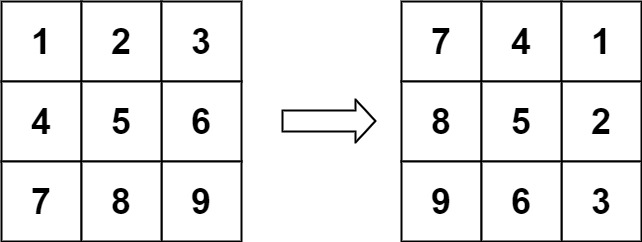
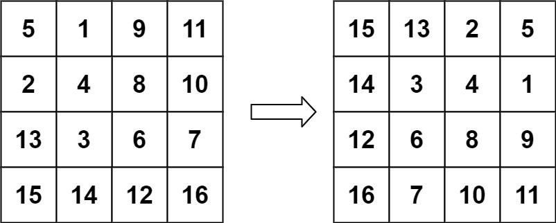

[](https://leetcode.com/problems/rorate-image/)

<!-- <br /> -->
<br />
<!-- <br /> -->

You are given an `n x n` 2D matrix representing an image, rotate the image by 90 degrees (clockwise).

You have to rotate the image in-place, which means you have to modify the input 2D matrix directly. DO NOT allocate another 2D matrix and do the rotation.


**Example 1:**


```
Input: matrix = [[1,2,3],[4,5,6],[7,8,9]]
Output: [[7,4,1],[8,5,2],[9,6,3]]
```

**Example 2:**


```
Input: matrix = [[5,1,9,11],[2,4,8,10],[13,3,6,7],[15,14,12,16]]
Output: [[15,13,2,5],[14,3,4,1],[12,6,8,9],[16,7,10,11]]
```

**Constraints:**
```
n == matrix.length == matrix[i].length
1 <= n <= 20
-1000 <= matrix[i][j] <= 1000
```

**Solutions**

```ts
// Method 1: Transpose and reverse
// Time complexity: O(n^2)
// Space complexity: O(1)
/**
 Do not return anything, modify matrix in-place instead.
 */
function rotate(matrix: number[][]): void {
  // rotate by y = [(matrix.length + 1) / 2]
  matrix.reverse();

  // rotate by x = y;
  reverseByDiagonal(matrix);
};

const reverseByDiagonal = (matrix: number[][]): void => {
  for (let i = 0; i < matrix.length; i++) {
    for (let j = i; j < matrix[i].length; j++) {
      [matrix[i][j], matrix[j][i]] = [matrix[j][i], matrix[i][j]];
    }
  }
}
```

```ts
/**
 * Method 2: Rotate by layer
 * Time complexity: O(n^2)
 * Space complexity: O(1)
 */
function rotate(matrix: number[][]): void {
  const n = matrix.length;
  for (let i = 0; i < Math.floor(n / 2); i++) {
    for (let j = i; j < n - i - 1; j++) {
      [matrix[i][j], matrix[n - j - 1][i], matrix[n - i - 1][n - j - 1], matrix[j][n - i - 1]] =
      [matrix[n - j - 1][i], matrix[n - i - 1][n - j - 1], matrix[j][n - i - 1], matrix[i][j]];
    }
  }
}
```