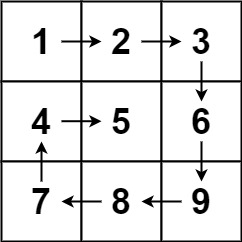
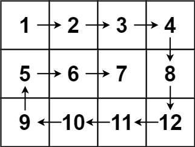

[](https://leetcode.com/problems/spiral-matrix/)

<!-- <br /> -->
<br />
<!-- <br /> -->

Given an `m x n` matrix, return all elements of the matrix in spiral order.


**Example 1:**


```
Input: matrix = [[1,2,3],[4,5,6],[7,8,9]]
Output: [1,2,3,6,9,8,7,4,5]
```

**Example 2:**


```
Input: matrix = [[1,2,3,4],[5,6,7,8],[9,10,11,12]]
Output: [1,2,3,4,8,12,11,10,9,5,6,7]
```

**Constraints:**
```
m == matrix.length
n == matrix[i].length
1 <= m, n <= 10
-100 <= matrix[i][j] <= 100
```

**Solutions**

```ts
// Method 1: Iterative
// Time complexity: O(n)
// Space complexity: O(1)
function spiralOrder(matrix: number[][]): number[] {
  const result: number[] = [];
  let [top, bottom, left, right] = [0, matrix.length - 1, 0, matrix[0].length - 1];

  while (top <= bottom && left <= right) {
    for (let i = left; i <= right; i++) {
      result.push(matrix[top][i]);
    }
    top++;

    for (let i = top; i <= bottom; i++) {
      result.push(matrix[i][right]);
    }
    right--;

    if (top <= bottom) {
      for (let i = right; i >= left; i--) {
        result.push(matrix[bottom][i]);
      }
      bottom--;
    }

    if (left <= right) {
      for (let i = bottom; i >= top; i--) {
        result.push(matrix[i][left]);
      }
      left++;
    }
  }

  return result;
}
```


```ts
// Method 2: Recursive
// Time complexity: O(n)
// Space complexity: O(n)
function spiralOrder(matrix: number[][]): number[] {
  const result: number[] = [];
  const spiral = (matrix: number[][], top: number, bottom: number, left: number, right: number) => {
    if (top > bottom || left > right) return;

    for (let i = left; i <= right; i++) {
      result.push(matrix[top][i]);
    }
    top++;

    for (let i = top; i <= bottom; i++) {
      result.push(matrix[i][right]);
    }
    right--;

    if (top <= bottom) {
      for (let i = right; i >= left; i--) {
        result.push(matrix[bottom][i]);
      }
      bottom--;
    }

    if (left <= right) {
      for (let i = bottom; i >= top; i--) {
        result.push(matrix[i][left]);
      }
      left++;
    }

    spiral(matrix, top, bottom, left, right);
  }

  spiral(matrix, 0, matrix.length - 1, 0, matrix[0].length - 1);
  return result;
}
```

```ts
// Method 3: Using shift
// Time complexity: O(n)
// Space complexity: O(1)
function spiralOrder(matrix: number[][]): number[] {
  const result: number[] = [];

  while (matrix.length) {
    result.push(...matrix.shift());
    for (let i = 0; i < matrix.length; i++) {
      result.push(matrix[i].pop());
    }
    result.push(...(matrix.pop() || []).reverse());
    for (let i = matrix.length - 1; i >= 0; i--) {
      result.push(matrix[i].shift());
    }
  }

  return result;
}
```


```ts
type Direct = number[];
type Coordinate = {
  dx: number,
  dy: number
}

function spiralOrder(matrix: number[][]): number[] {
  let cord:Coordinate = {
    dx: 0,
    dy: 0
  }
  //            N. E. S. W
  let direct = [0, 1, 0, 0];
  let res = [];
  let turnedRight = false;

  while(true) {
    if (shouldTurnRight(cord, direct, matrix)) {
      if (turnedRight) break;
      direct = turnRight(direct);
      turnedRight = true;
    } else {
      const {dx, dy} = cord;
      res.push(matrix[dx][dy]);
      matrix[dx][dy] = 0; // visited
      cord = moveForward(cord, direct);
      turnedRight = false;
    }
  }

  return res;
};


const turnRight = (direct: Direct): Direct => {
  direct.unshift(direct.pop());
  return direct;
}

const moveForward = (cord: Coordinate, direct: Direct): Coordinate => {
  let {dx, dy} = cord;
  return {
    dx: dx + direct[1] - direct[3],
    dy: dy + direct[0] - direct[2]
  };
}

const shouldTurnRight = (cord: Coordinate, direct: Direct, matrix: number[][]): boolean => {
  let {dx, dy} = moveForward(cord, direct);
  return dx >= matrix[0].length || dy >= matrix.length ||
    matrix[dx][dy] === 0;
}
```