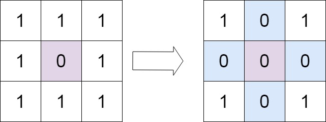
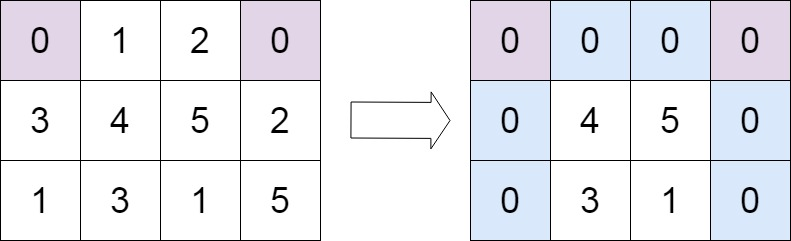

[](https://leetcode.com/problems/set-matrix-zeroes/)

<!-- <br /> -->
<br />
<!-- <br /> -->

Given an `m x n` integer matrix matrix, if an element is 0, set its entire row and column to 0's.

You must do it in place.


**Example 1:**


```
Input: matrix = [[1,1,1],[1,0,1],[1,1,1]]
Output: [[1,0,1],[0,0,0],[1,0,1]]
```

**Example 2:**


```
m == matrix.length
n == matrix[0].length
1 <= m, n <= 200
-2^31 <= matrix[i][j] <= 2^31 - 1
```

**Constraints:**
```
n == matrix.length == matrix[i].length
1 <= n <= 20
-1000 <= matrix[i][j] <= 1000
```

**Follow up:**

```
A straightforward solution using O(mn) space is probably a bad idea.
A simple improvement uses O(m + n) space, but still not the best solution.
Could you devise a constant space solution?
```

**Solutions**

```ts
// Method 1: Using extra space
// Time complexity: O(n^2)
// Space complexity: O(n)

/**
 * Do not return anything, modify matrix in-place instead.
 */
function setZeroes(matrix: number[][]): void {
  let rows = new Set<number>();
  let cols = new Set<number>();
  for (let i = 0; i < matrix.length; i++) {
    for (let j = 0; j < matrix[i].length; j++) {
      if (matrix[i][j] === 0) {
        rows.add(i);
        cols.add(j);
      }
    }
  }

  rows.forEach(row => {
    for (let col in matrix[row]) {
      matrix[row][col] = 0;
    }
  })

  cols.forEach(col => {
    for (let row in matrix) {
      matrix[row][col] = 0;
    }
  })
};

```

```ts
// Method 2: Using first row and first column as flags
// Time complexity: O(n^2)
// Space complexity: O(1)

/**
 * Do not return anything, modify matrix in-place instead.
 */
function setZeroes(matrix: number[][]): void {
  let firstRowHasZero = false;
  let firstColHasZero = false;

  for (let i = 0; i < matrix.length; i++) {
    for (let j = 0; j < matrix[i].length; j++) {
      if (matrix[i][j] === 0) {
        if (i === 0) firstRowHasZero = true;
        if (j === 0) firstColHasZero = true;
        matrix[i][0] = 0;
        matrix[0][j] = 0;
      }
    }
  }

  for (let i = 1; i < matrix.length; i++) {
    for (let j = 1; j < matrix[i].length; j++) {
      if (matrix[i][0] === 0 || matrix[0][j] === 0) {
        matrix[i][j] = 0;
      }
    }
  }

  if (firstRowHasZero) {
    for (let j = 0; j < matrix[0].length; j++) {
      matrix[0][j] = 0;
    }
  }

  if (firstColHasZero) {
    for (let i = 0; i < matrix.length; i++) {
      matrix[i][0] = 0;
    }
  }
}
```

```ts
// Method 3: 
// Time complexity: O(n^2)
// Space complexity: O(1)

/**
 * Do not return anything, modify matrix in-place instead.
 */
function setZeroes(matrix: number[][]): void {
  let rows = new Set<number>();
  let cols = new Set<number>();
  for (let i = 0; i < matrix.length; i++) {
    for (let j = 0; j < matrix[i].length; j++) {
      if (matrix[i][j] === 0) {
        rows.add(i);
        cols.add(j);
      }
    }
  }

  for (let i = 0; i < matrix.length; i++) {
    for (let j = 0; j < matrix[i].length; j++) {
      if (rows.has(i) || cols.has(j)) {
        matrix[i][j] = 0;
      }
    }
  }
```